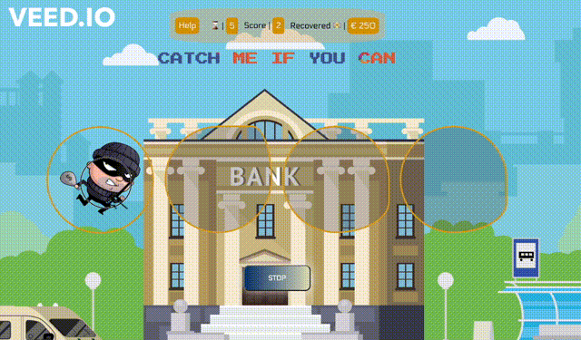

# Welcome to the **Speed Game Project**

## Introduction

Speed game is replica of the early 1990's speed game played by kids. The player has to hit the on light quickly and the light goes of and on faster with each passing round. This version is is themed "Catch me if you can", the player is a police officer trying to catch a bank rubber and recover stolen funds.

The Speed Game ("Catch me if you can" Version) is developed for kids between 2 to 7 years old to improve their reflexes and ability to use the computer mouse or track pad.

## Technologies

The game is developed using the following technologies;

- CSS
- HTML
- JavaScript
- React

## Setup and usage

See live project



Visit live page

https://oniso20.github.io/the-speed-game/

To use the application you can visit the live page: https://oniso20.github.io/the-speed-game/ or use your local machine;

1. Fork this repository
2. Clone the repository

Run the following commands in your terminal

```
npm install

```

```
npm start
```

## Contribution

**Author:** Onis Emem - https://github.com/oniso20

**Inspired by:** Margit Tennosaar - https://github.com/margittennosaar

### Resources

Background Image - https://www.vector4free.com/free-vectors/bank-building
